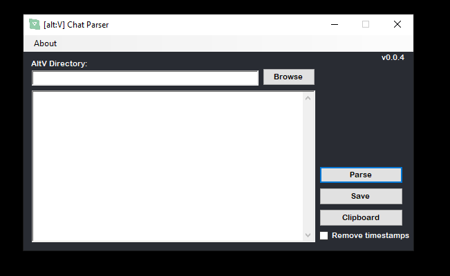

# alt:V Chat Log
This program is used to convert the chat logs generated while playing on GTA World into readable text.

This 'Fork' made no changes to the assistant, only the MiniParser.
Perhaps changes in the Wizard will be made in the future for a better experience.



## Getting Started

# Client
<!> Attention: This program will only be able to retrieve the logs if the server you play performs an adaptation in the logs to support the chat.

No installation is required. Simply download the latest [release](https://github.com/MacLove13/Altv-Log-Parser/releases) and run the executable.

# Server
A small change must be made so that players can use the Chat Log.

In the client-side of the chat, add the following code:
```
function logChat(name, action, message) {
  let finalMsg;
  if(name)
    finalMsg = `${name} ${action}: ${message}`;
  else
    finalMsg = message;

  alt.log(`chat_log: ${message}`);
}
```

And in your role responsible for Adding the message to Chat, call the function with the necessary parameters.

You can adapt the entire structure to your system, as long as the log is sent as follows: `alt.log (`chat_log: $ {message}`);`

## Building

The NuGet package dependencies must be restored before compiling the project.

## Credits

MapleToo (Creator of the base used program)
https://github.com/MapleToo/GTAW-Log-Parser

## Contributing

1. Fork Project (<https://github.com/your_name/Altv-Log-Parser>)
2. Create Branch (`git checkout -b branch_name`)
3. Commit (`git commit -am "Add feature_name"`)
4. Push (`git push origin branch_name`)
5. Create Pull Request

## Roadmap

- Switch to .NET Core 3.1, then .NET 5 (when available)

## Additional Information

Distributed under the GPLv3 license. See ``LICENSE`` for more information.
